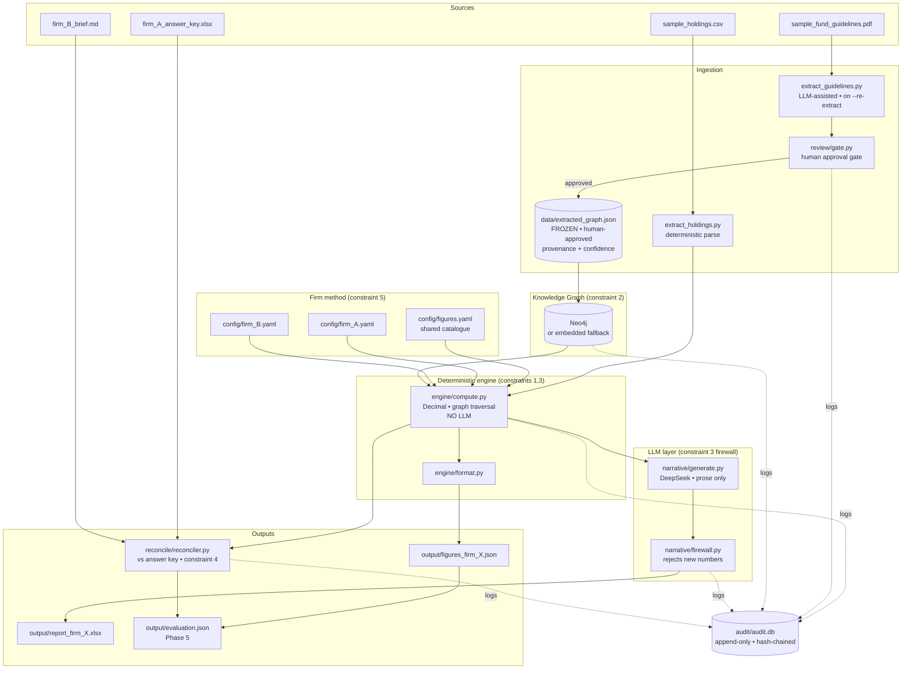

# Phase 1 — Architecture

## Component diagram



## How each constraint maps to a component

| Constraint | Where it lives | Mechanism |
|---|---|---|
| 1 — reproducible | `src/util.py`, `src/engine/` | `Decimal` everywhere, fixed rounding policy, sorted iteration, frozen ingestion timestamps, `sort_keys` JSON. Re-runs are byte-identical. |
| 2 — traceable through graph | `src/graph/`, `src/engine/compute.py` | Figure inputs are obtained by graph traversal; each figure emits `graph_path` + `citation`; untraceable → `status: ERROR`. |
| 3 — no LLM numbers | `src/engine/` vs `src/narrative/` | Hard module boundary + firewall that rejects any narrative number not in the computed set. |
| 4 — reproduce Firm A | `src/reconcile/` | Per-figure diff vs `firm_A_answer_key.xlsx`. |
| 5 — reconfigure to Firm B | `config/*.yaml`, `src/config/loader.py` | Firm method is config-selected; engine implements all strategies; no code edit to switch. |
| append-only audit | `src/audit/log.py` | SQLite with `BEFORE UPDATE/DELETE → RAISE(ABORT)` triggers + SHA-256 hash chain. |

## Data flow for one figure (worked example: `aggregate_non_ig_exposure`)

```
config/firm_B.yaml: non_ig_membership = rating_incl_fallen_angels
        │
        ▼
engine/compute.py:_h_aggregate_non_ig
        │  traverses graph:
        │    (AssetClass:high_yield)-[:CONTRIBUTES_TO]->(Aggregate:non_ig)
        │    (AssetClass:structured_credit)-[:CONTRIBUTES_TO]->(Aggregate:non_ig)
        │    (Aggregate:non_ig)-[:HAS_LIMIT]->(Limit{max:20})
        │  + Firm-B rule: positions with credit_rating < BBB- join (Marina Bay BB)
        ▼
value = (HY 9M + SC 6M + Marina Bay 6M) / 100M = 21.0%   →  status BREACH (>20%)
citation = guidelines p.2 chunk_2b71 "aggregate non-IG cap"
```

The same handler under `firm_A.yaml` (`non_ig_membership = asset_class`) omits the
fallen-angel branch and yields `15.0% — OK`. **Same code, different config.**

## Backends

The graph layer has two interchangeable backends behind one interface
(`src/graph/client.py`):
- **Neo4j** — the docker-compose default; real Cypher traversals.
- **Embedded** — pure-Python over the same nodes/edges; lets the system run with
  `pip install` only and lets tests run with no external service.

Both return identical view structures, so figures and graph paths are
backend-independent.
